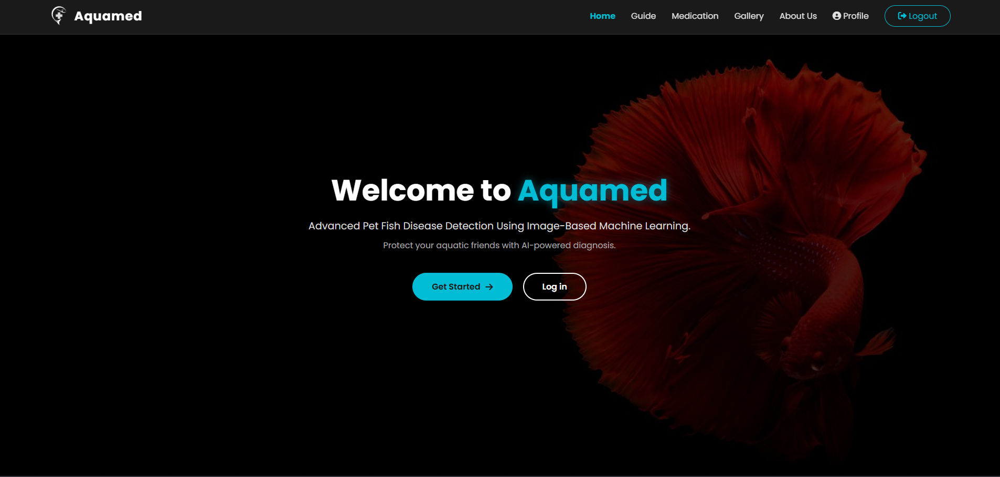
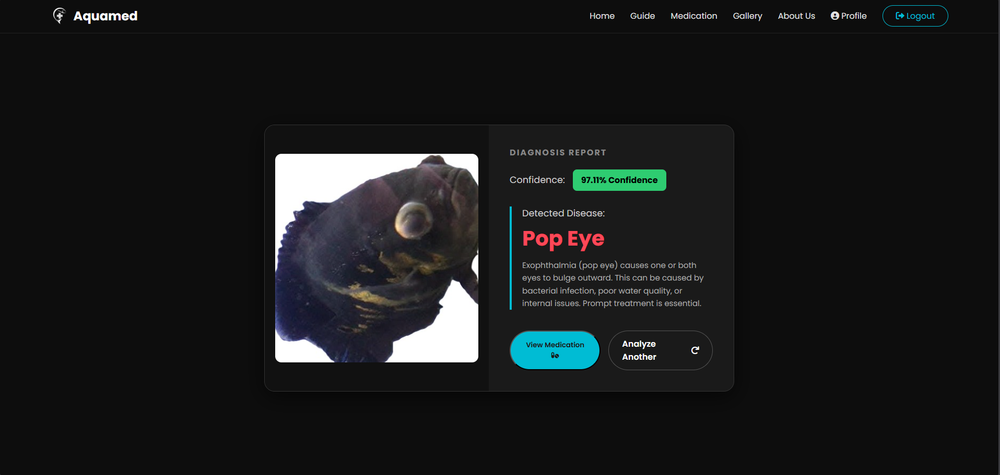
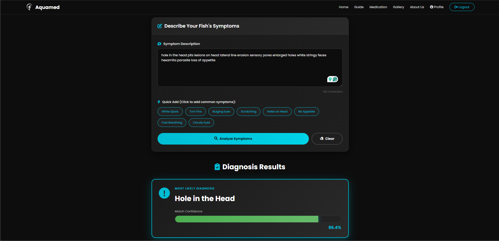

# 🐠 Aquamed — Pet Fish Disease Detection System

<div align="center">


**An AI-powered web application that detects pet fish diseases from images using MobileNetV2 — a lightweight CNN model trained on a custom-collected dataset from Sri Lankan aquarium shops and social media.**


</div>

---

## 📸 Application Preview

<div align="center">
  
  <p><em>Aquamed — Landing Page</em></p>
</div>

<div align="center">
  <h3>AI Image-Based Diagnosis</h3>
  
  <p><em>Real-time disease detection with 92.96% confidence</em></p>
  
  <br>

  <h3>TF-IDF Symptom Checker</h3>
  
  <p><em>Text-based analysis for symptoms like 'Hole in the head'</em></p>
</div>

---

## 📌 Project Overview

Aquamed is an end-to-end **AI-powered fish disease detection platform** that helps fish owners and aquarium shop owners identify common fish diseases by simply uploading a photo.

This system goes beyond simple detection by combining:
- **Multimodal AI** — Image-based CNN detection + text-based TF-IDF symptom checker
- **Veterinary expertise** — All medication guidelines verified by a professional Veterinary Surgeon
- **Continuous learning** — Database logging for future model retraining
- **Responsive Web UI** — Accessible from any device

> ⚠️ **Custom Dataset** — All training images were manually collected from local aquarium shop visits and social media platforms in Sri Lanka. Not from Kaggle or any public source.

---

## 🎯 Diseases Detected

| Disease | Fish Varieties Supported |
|---|---|
| 🔴 **Fin Rot** | Oscar, Koi Fish, Goldfish, Angel Fish |
| 👁️ **Popeye** | Oscar, Koi Fish, Goldfish, Angel Fish |
| ⚪ **White Spots (Ich)** | Oscar, Koi Fish, Goldfish, Angel Fish |
| 🕳️ **Hole in the Head** | Oscar, Koi Fish, Goldfish, Angel Fish |
| ✅ **Healthy** | Oscar, Koi Fish, Goldfish, Angel Fish |

> If the system confidence is below **60%**, the result is classified as **"Inconclusive"** to prevent wrong diagnoses.

---

## 🧠 Model Performance

| Detail | Value |
|---|---|
| **Base Architecture** | MobileNetV2 (Lightweight CNN) |
| **Framework** | TensorFlow / Keras |
| **Test Accuracy** | **92%** |
| **Models Evaluated** | MobileNetV2, ResNet50, VGG16 |
| **Final Model** | MobileNetV2 (best accuracy) |
| **Dataset Size** | ~2,500+ images (custom collected) |
| **Confidence Threshold** | 60% (below = Inconclusive) |

---

## 🚀 Key Features

- **Image-Based Disease Detection** — Upload a fish photo and get instant AI diagnosis
- **TF-IDF Symptom Checker** — Text-based disease diagnosis for cases without clear images
- **Veterinary-Verified Medication** — Treatment guidelines verified by a professional Vet
- **Continuous Learning System** — Database logging for future model retraining
- **Multi-City Gallery** — Information on Sri Lankan endemic fish species
- **User Authentication** — Login/Signup system with secure session management
- **Responsive Dark UI** — Modern, mobile-friendly web interface

---

## 🛠️ Tech Stack

| Layer | Technology |
|---|---|
| **Backend** | Python, Flask |
| **Deep Learning** | TensorFlow, Keras, MobileNetV2 |
| **NLP** | TF-IDF (Symptom Checker) |
| **Frontend** | HTML, CSS, JavaScript |
| **Database** | SQLite |
| **Image Processing** | Pillow, OpenCV |
| **Data Augmentation** | Keras ImageDataGenerator |

---

## 🏗️ System Architecture

```
User (Browser)
     │
     ▼
Flask Backend (app.py)
     │
     ├── MobileNetV2 Model (.keras)
     │     └── Image Classification (5 classes)
     │
     ├── TF-IDF Symptom Checker
     │     └── Text-based diagnosis
     │
     ├── SQLite Database
     │     └── User data + prediction logs
     │
     └── diseases.json
           └── Medication & treatment info
```

---

## 📁 Project Structure

```
AQUAMED_System/
│
├── app.py                               # Main Flask application
├── requirements.txt                     # Python dependencies
├── diseases.json                        # Disease & medication info
├── fish_disease_final_cnn_acc_92.keras  # Trained MobileNetV2 model
├── HOW TO RUN.txt                       # Quick start guide
│
├── static/
│   ├── css/                             # Stylesheets
│   ├── js/                              # JavaScript files
│   └── images/                          # UI images & gallery
│
├── templates/                           # HTML pages
│   ├── landing_page.html
│   ├── upload_page.html
│   ├── identification_page.html
│   ├── symptom_checker.html
│   ├── medication_page.html
│   ├── gallary_page.html
│   └── ...
│
└── test_data/                           # Sample test images
    ├── finrot/
    ├── healthy/
    ├── hole_in_head/
    ├── popeye/
    └── whitespot/
```

---

## 📦 Dataset

> The full training dataset (~1.89 GB, 5,400+ images) is **not included** due to size constraints.

**Manually collected from:**
- 🏪 Local aquarium shop visits in Sri Lanka
- 📱 Social media platforms and aquarium communities
- ✂️ All images manually cropped to reduce background noise

**📥 Download the full dataset:**
👉 [Google Drive — Aquamed Dataset](https://drive.google.com/drive/folders/1sHxmRF2ptPROI90cCl1ZwqNHPQ6gWTXX?usp=sharing)

---

## ⚙️ Getting Started

### Step 1 — Clone the Repository
```bash
git clone https://github.com/NisalDamsika/Aquamed.git
cd Aquamed
```

### Step 2 — Create Virtual Environment
```bash
python -m venv venv

# Windows
venv\Scripts\activate

# Mac/Linux
source venv/bin/activate
```

### Step 3 — Install Dependencies
```bash
pip install -r requirements.txt
```

### Step 4 — Run the App
```bash
python app.py
```

Open browser → **`http://127.0.0.1:5000`**

---

## 🧪 Testing the Model

Sample test images are in `test_data/` folder:

```
test_data/
├── finrot/        ← Fin Rot samples
├── healthy/       ← Healthy fish
├── hole_in_head/  ← Hole in the Head
├── popeye/        ← Popeye samples
└── whitespot/     ← White Spot samples
```

---

## 🔮 Future Directions

- 📱 **Mobile App** — iOS and Android version for wider accessibility
- 🎥 **Real-time Video Analysis** — Behavioral tracking for proactive disease detection
- 🌊 **IoT Sensor Integration** — Continuous water quality monitoring

---

## 👥 Team 

| Name | Role | GitHub |
|---|---|---|
| **K.W. Nisal Damsika** | ML Model & API Integration | [@NisalDamsika](https://github.com/NisalDamsika) |
| **S.M.N.N. Samarathunga** | Frontend Development | [@nipunnirmal21](https://github.com/nipunnirmal21) |
| **M.G.D.H. Wijebandara** | Backend & Database | [@deshwije2000](https://github.com/deshwije2000) |

---

<div align="center">
  <em>Built with ❤️ for fish lovers and aquarium enthusiasts in Sri Lanka 🇱🇰</em>
</div>
